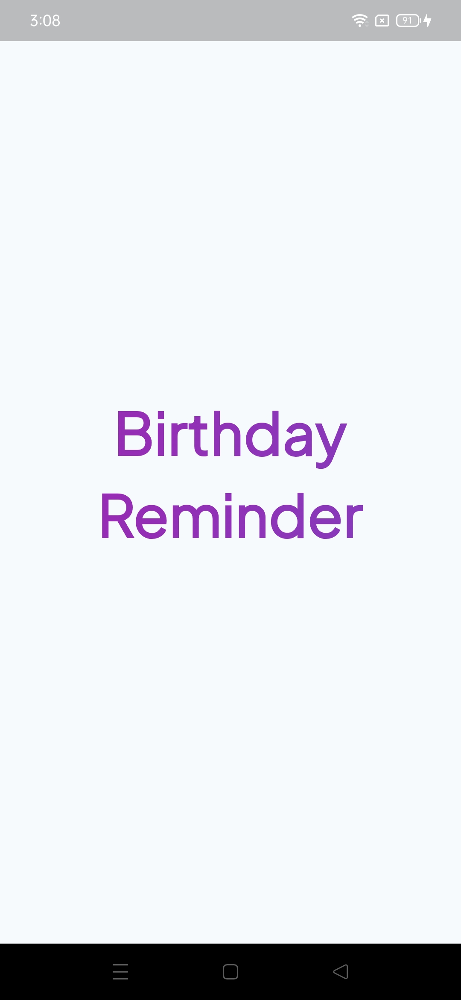
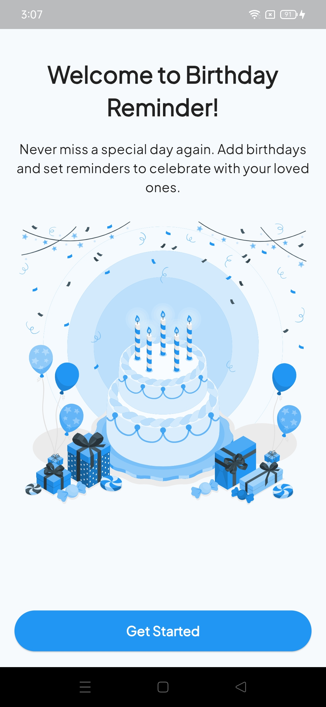
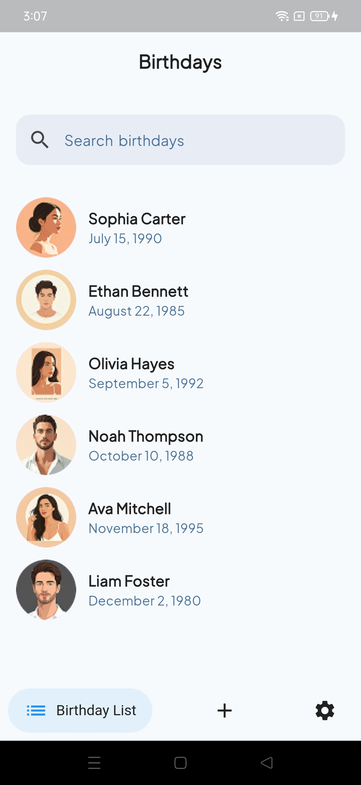
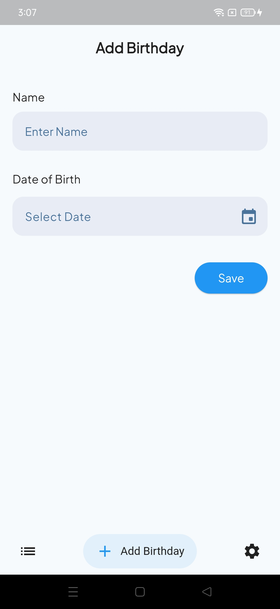
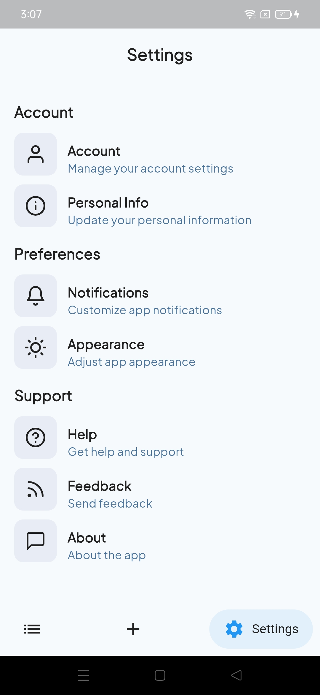
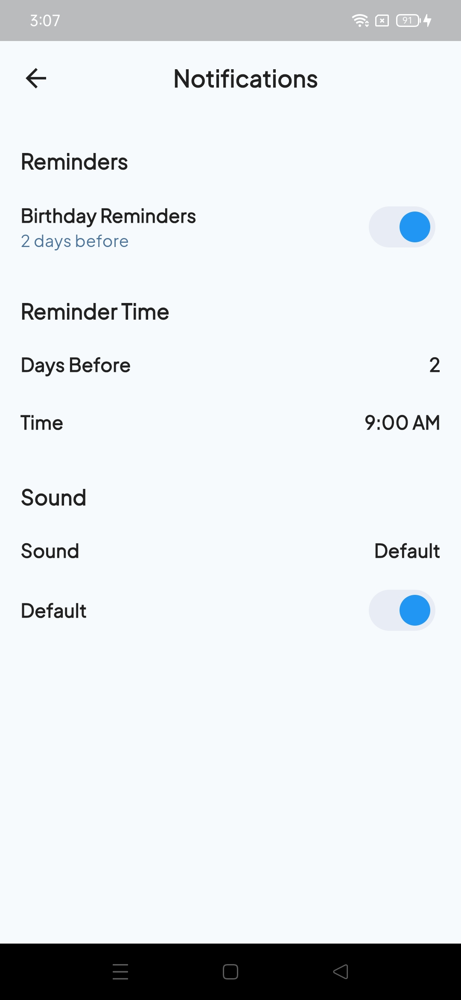

	<h2>Birthday Reminder - A Birthday Reminder App UI</h2>
    <table align='center'>
        Click on any image to enlarge it. To know more, explore and see for yourself.
        <tr>
            <td></td>
            <td></td>
            <td></td>
        </tr>
        <tr>
            <td></td>
            <td></td>
            <td></td>
        </tr>
    </table>

## Getting Started

This project is a starting point for a Flutter application.

A few resources to get you started if this is your first Flutter project:

- [Lab: Write your first Flutter app](https://docs.flutter.dev/get-started/codelab)
- [Cookbook: Useful Flutter samples](https://docs.flutter.dev/cookbook)

For help getting started with Flutter development, view the
[online documentation](https://docs.flutter.dev/), which offers tutorials,
samples, guidance on mobile development, and a full API reference.
